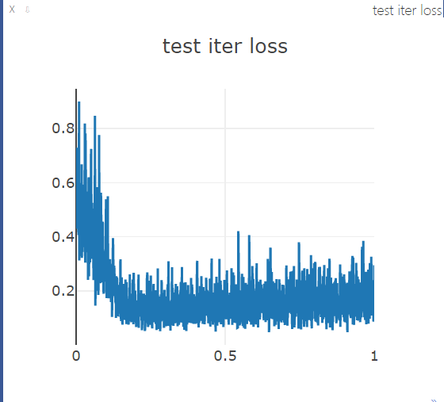
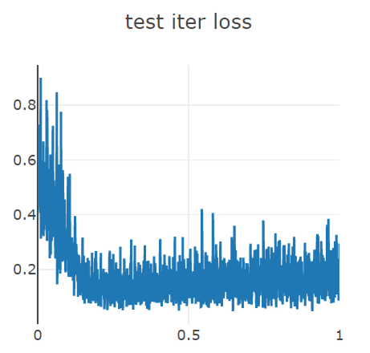

# FCN_Based语义分割


本仓库对应认知大作业第三题，选择FCN网络搭建并在威尔兹曼马数据集上实验。

搭建了FCN16s、FCN8s和FCN32s，backbone选择VGG。  

##运行环境  
- Python == 3.5
- pytorch == 1.0
- torchvision == 0.3.2
- visdom == 0.1.8.5
- OpenCV == 3.5.1
>具体操作
>1. 打开cmd，输入  
>```python train.py```
>
>2. 打开另一个cmd，进入编译环境，输入
>
>```python -m visdom.server```
>
>  在运行约1~10个epoch后，将出现visdom的可视化界面入口
>
>  
>
>  

## 数据集
在training data和ground-truth分别有600张图片（0.jpg ~ 599.jpg）。
## 可视化
- train prediction：训练时模型的输出
- label：ground-truth
- test prediction：预测时模型的输出
- train iter loss：训练时每个batch的loss
- test iter loss：测试时每个batch的loss
## 代码
1. train.py
- 训练FCN网络，嵌入可视化代码
- main函数
2. FCN.py
- FCN32s、FCN16s、FCN8s、FCNs网络定义
- 定义VGGNet、决定VGG不同种类网络参数、构建VGG网络
3. mIOUCal.py
- 计算mIOU值

- 定义方便PyTorch读取数据的Dataset和DataLoader
- 定义数据的变换transform


